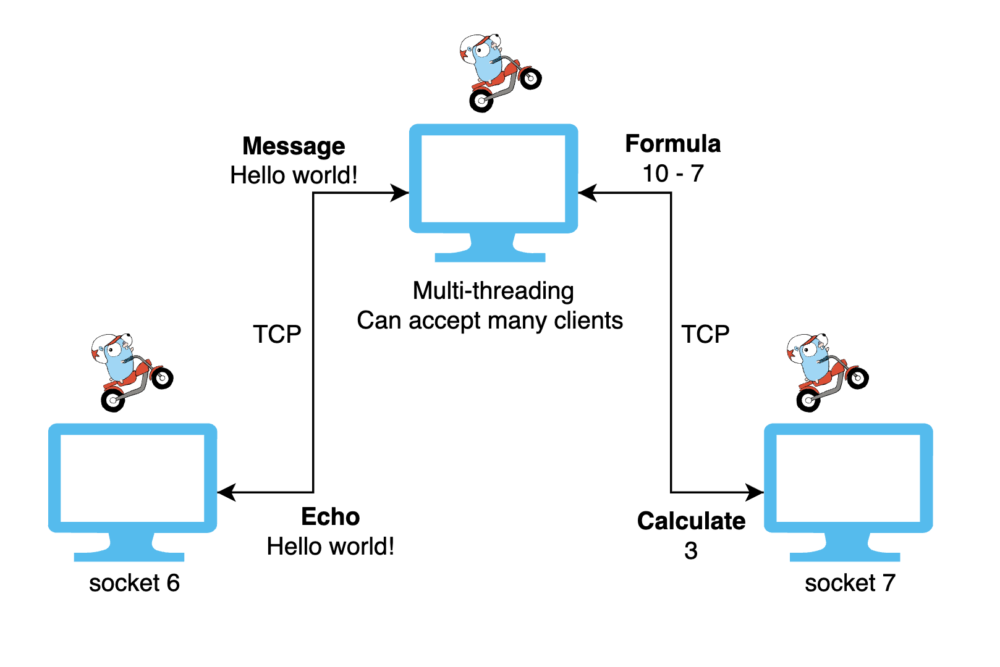

<p align="center">
  <a href="https://go.dev/" target="blank"></a>
</p>

## Description

Practice of Golang tcp server with POSIX API

## Architecture


## Running the app

### Server
```bash
$ cd tcp-server
$ go run main.go
```

### Client
```bash
$ cd tcp-client
$ go run main.go
```

## Warning ⚠️

If you intend to shut down the application, it is recommended to turn off the client first before stopping the server.

This sequence ensures a graceful shutdown, preventing potential issues and minimizing data loss.
